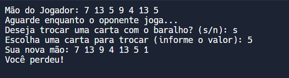

# JOGO DO PIFE EM C PLUS PLUS
👨‍💻ESSE É PEQUENO JOGO QUE RODA NO CONSOLE DA IDE.

 <br>

## DESCRIÇÃO:
O **Pife** é um jogo de cartas popular no Brasil, conhecido também como "Pif-Paf" ou simplesmente "Pife". É um jogo tradicional que pode ser jogado por 2 a 4 jogadores e utiliza um baralho padrão de 52 cartas. O objetivo do jogo é formar combinações de cartas para ganhar pontos ou completar um determinado objetivo antes dos outros jogadores.

## OBJETIVO:
1. **Trinca**: Três cartas do mesmo valor (por exemplo, três 7s).
2. **Sequência**: Três ou mais cartas em ordem numérica do mesmo naipe (por exemplo, 4, 5 e 6 de copas).

O jogo geralmente termina quando um jogador consegue formar uma combinação válida, ou após um número determinado de rodadas, dependendo das regras específicas que você decidir seguir.

## EXECUTANDO O JOGO:
### COMO EXECUTAR O CÓDIGO?
1. **Compilar o Código:**
   - Abra um terminal ou prompt de comando e navegue até o diretório onde o arquivo está salvo.
   - Compile o código com o comando:

     ```bash
     g++ -o CODIGO CODIGO.cpp
     ```

2. **Executar o Programa:**
   - Execute o programa com o comando:

     ```bash
     ./CODIGO
     ```

### COMO JOGAR?
1. **Preparação:**
   - **Baralho**: O jogo utiliza um baralho padrão de 52 cartas, com 4 naipes (copas, paus, ouros e espadas) e 13 valores (de 1 a 13).
   - **Distribuição**: Cada jogador recebe um número fixo de cartas (geralmente 7). As cartas restantes formam o baralho de compra.

2. **Turnos:**
   - **Compra**: No início de cada turno, o jogador compra uma carta do baralho.
   - **Ação**: Após comprar, o jogador pode optar por trocar uma de suas cartas com uma do baralho, tentando melhorar sua mão para formar combinações.
   - **Descartar**: O jogador deve descartar uma carta para terminar seu turno. A carta descartada é colocada em uma pilha de descarte.

3. **Formação de Combinações:**
   - O jogador deve tentar formar trincas ou sequências com as cartas da sua mão. Uma combinação válida pode ser mostrada para a mesa em alguns variantes do jogo.

4. **Verificação de Vitória:**
   - O jogo geralmente verifica se o jogador tem uma combinação válida ao final do turno ou ao final de todas as rodadas.
   - Em algumas variantes, o jogo termina quando um jogador consegue formar uma combinação válida e mostrar suas cartas, ou quando o baralho de compra acaba.

#### EXEMPLO DE TURNO:
1. **Compra**: O jogador compra uma carta do baralho ou do monte de descarte.
2. **Ação**: O jogador pode optar por trocar uma de suas cartas com a carta comprada.
3. **Descartar**: O jogador descarta uma carta de sua mão para o monte de descarte.

#### CONDIÇÕES DE VITÓRIA:
- **Trinca**: Formar três cartas do mesmo valor.
- **Sequência**: Formar uma sequência de três ou mais cartas do mesmo naipe.

#### DICAS PARA JOGAR:
- **Observe o Baralho**: Preste atenção nas cartas que estão sendo descartadas pelos outros jogadores. Isso pode dar uma ideia das cartas que eles estão tentando formar.
- **Gerencie sua Mão**: Tente manter cartas que podem ser facilmente combinadas e descarte cartas que não ajudam a formar combinações.

## NÃO SABE?
- Entendemos que para manipular arquivos em muitas linguagens e tecnologias, é necessário possuir conhecimento nessas áreas. Para auxiliar nesse aprendizado, oferecemos cursos gratuitos disponíveis:
* [CURSO DE C++](https://github.com/VILHALVA/CURSO-DE-C-PLUS-PLUS)
* [CONFIRA MAIS CURSOS](https://github.com/VILHALVA?tab=repositories&q=+topic:CURSO)

## CREDITOS:
- [PROJETO CRIADO PELO VILHALVA](https://github.com/VILHALVA)
